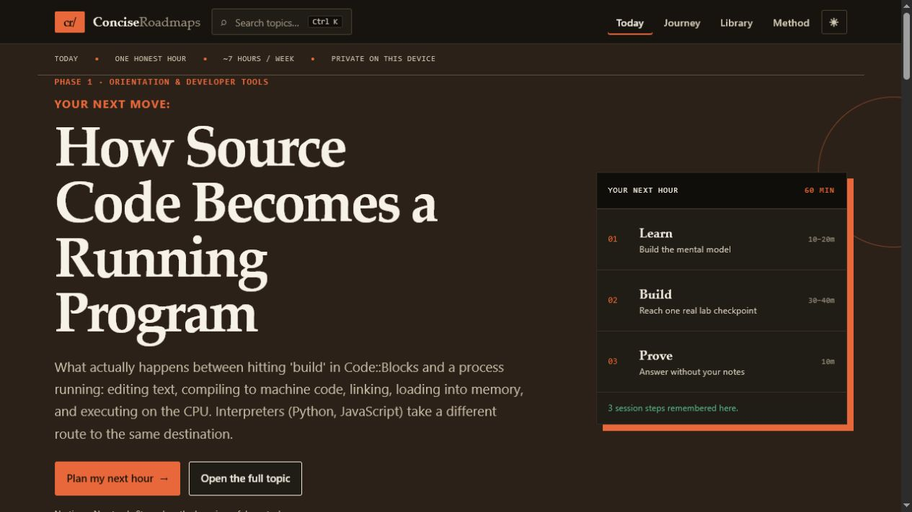
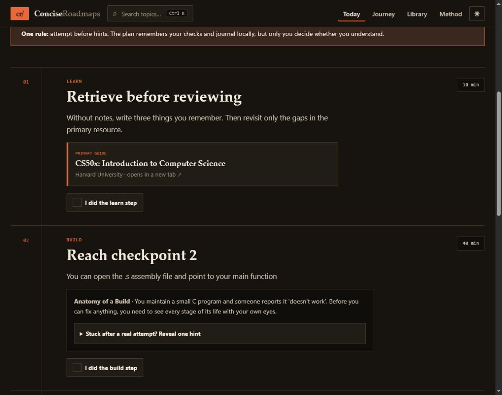
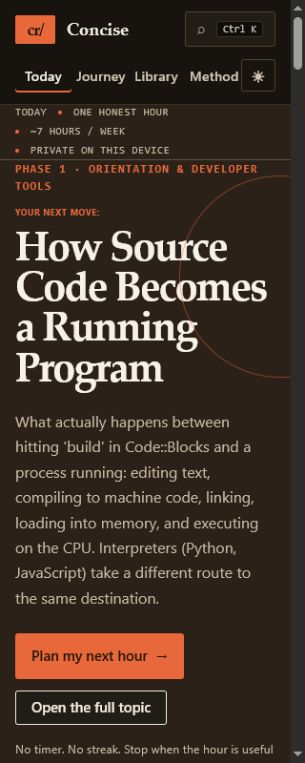

# ConciseRoadmaps

The practice-first software-engineering roadmap that tells you what to do for the
next hour.

ConciseRoadmaps is built for a first-year CS student who knows C through linked
lists, studies about seven hours a week on Windows, and wants to become a
self-sufficient engineer with strong CS, systems, architecture, and ethical-security
foundations. It is not a course dashboard. It is a calm, local-first learning
instrument that turns a carefully tested curriculum into real work.

## The experience



The first screen answers four questions immediately:

- What should I learn next?
- Why does it come now?
- What can I do in the next 60 minutes?
- How does that hour fit a seven-hour study week?

The answer is always grounded in the real prerequisite graph. A fresh learner starts
with “How Source Code Becomes a Running Program”; a returning learner resumes the most
recent incomplete topic; completed topics are skipped along the required trunk.

## Focus sessions



“Plan my next hour” opens a focused Learn → Build → Prove workspace:

1. **Learn** for 10–20 minutes using the topic’s verified primary resource and exact
   viewing/reading guidance.
2. **Build** for 30–40 minutes toward the first unfinished checkpoint in the topic’s
   real lab. One progressive hint is available only after an honest attempt.
3. **Prove** for 10 minutes with the first unfinished mastery check—answered aloud,
   sketched, or written without notes.

The three tasks stay fixed for the current visit so checks do not move under the
learner. On the next visit, the plan advances to the next unfinished lab checkpoint,
validation step, and mastery check. Time spent never marks a topic complete; the
learner makes that judgment after producing evidence.

Each topic also has a private build journal for surprises, blockers, and the next
attempt. Journal text and session checks live only in the browser.

## The journey underneath

The orientation layer sits above—never instead of—the inherited curriculum:

- **78 topic clusters across 12 branches**
- **10 tested phases** that form a genuine topological ordering of the prerequisite graph
- **11 cross-branch milestone projects** with requirements, architecture, checkpoints,
  tests, progressive hints, and solution outlines (never paste-ready project code)
- A hand-audited catalog of real resources with exact titles, URLs, providers, and
  topic-specific guidance
- A substantial practical lab and mastery checks for every topic

The guided journey can be expanded phase by phase. “Browse all” exposes the complete
catalog with branch and completion filters. Global search (`Ctrl/Cmd + K`) indexes
topics, concepts, labs, projects, languages, and resources.

## Learner-owned memory

Completion marks, recent topics, session checks, and journal entries are local-first:

- no account, backend, telemetry, streak, XP, leaderboard, or deadline;
- guarded `localStorage` with an in-memory fallback when storage is unavailable;
- cross-tab updates;
- one versioned JSON export containing all learner data;
- backward-compatible import of the previous completion-only format;
- one reset that erases completions, recents, session checks, and journal entries.

Progress is deliberately a memory aid, not a score. Optional side branches never block
100% of the required path.

## Accessibility and responsive behavior



- Keyboard-only parity, deterministic route focus, skip link, modal focus trapping,
  and screen-reader coherent names and status announcements
- WCAG AA text contrast in light and dark themes, checked from the actual CSS tokens
- Reduced-motion support for every transition
- A single-column experience from 320 px upward with no page-level horizontal overflow
- Touch-friendly controls and an accessible search combobox

## Run it

Requires Node 18+.

```bash
npm install
npm run dev
npm run test
npm run check:contrast
npm run build
npm run preview
```

No environment variables, services, accounts, or secrets are required.

## Architecture

```text
src/
  data/
    topics/meta/          eager card and prerequisite data, one file per branch
    topics/body/          lazy labs, resources, and mastery content
    phases.ts             the tested ten-phase guided order
    milestones*.ts        eager milestone cards + lazy full briefs
    resourceCatalog.ts    verified resource identity and URLs
  components/
    FocusDesk.tsx         current topic, next-hour shape, weekly horizon
    StudySession.tsx      Learn → Build → Prove workspace and journal
    TopicDetail.tsx       complete topic, lab, resources, and connections
    roadmap/              guided journey and full catalog
  lib/
    focusPlan.ts          pure next-session derivation over real topic content
    practiceStore.ts      local session evidence and journal
    learnerData.ts        portable v2 export/import over all learner state
    progress*.ts          completion, readiness, resume, and local progress
  styles/                 CSS tokens and route-level editorial layouts
```

The eager/lightweight and lazy/prose halves of every topic are joined by id. The join
throws if either half is missing. Reverse prerequisite links are derived, never
hand-authored.

## Tests and curriculum integrity

`npm run test` runs 99 tests over the real curriculum and learning machinery. They
cover unique ids, populated fields, resource identity, valid HTTPS URLs, the acyclic
prerequisite graph, phase topological ordering, milestone placement, search, progress,
portable learner data, and focus-session advancement.

`npm run build` adds strict TypeScript checking. `npm run check:contrast` checks every
foreground/background token pair in both themes. `npm run audit:resources` is the
optional network-dependent catalog audit; its latest evidence is in
[RESOURCE_AUDIT.md](RESOURCE_AUDIT.md).

## Editing the curriculum

Read [CURRICULUM.md](CURRICULUM.md) for the learning philosophy and
[CONTRIBUTING.md](CONTRIBUTING.md) for the authoring rules. In short: edit the topic’s
eager meta half and lazy body half under the same permanent id, maintain only
`prerequisiteIds`, reuse verified catalog resources, and run the tests.

## Deployment

The finished app is published privately at
[concise-roadmaps-study.besnikmanushi.chatgpt.site](https://concise-roadmaps-study.besnikmanushi.chatgpt.site).

The build remains a static Vite app with relative assets and hash routing. A tiny
generated Worker entrypoint in `dist/server/index.js` delegates requests to the static
asset binding for Sites hosting; no learner data or application logic moved to a
backend. The same `dist/` can still be served from GitHub Pages or any static host
without rewrite rules, and the existing Pages workflow remains available.

## License

[MIT](LICENSE)
